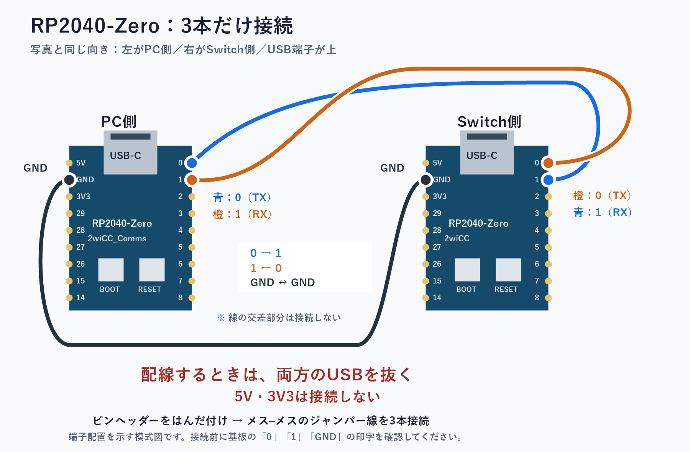
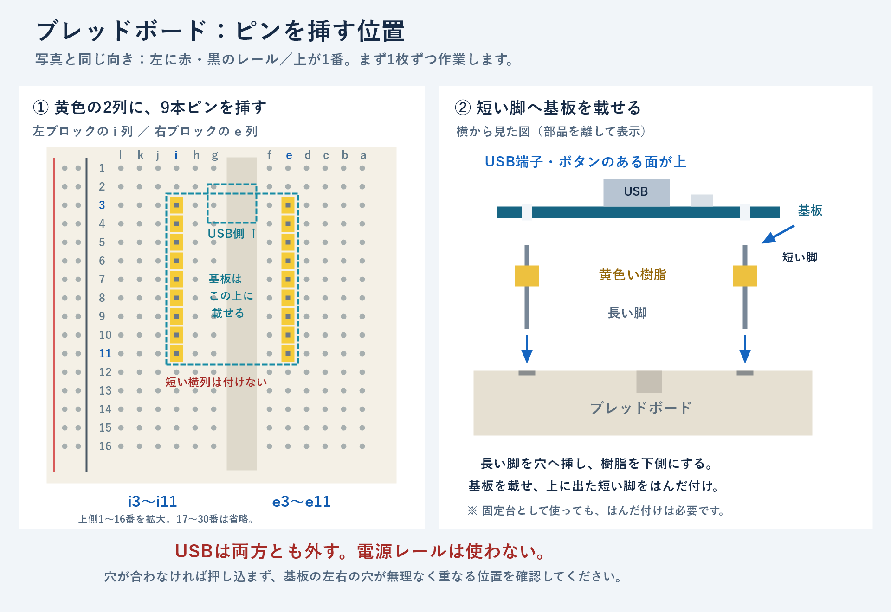

# RP2040-Zero 2枚で作る自動操作用コントローラー：全体手順

作成日・実施記録更新日：2026-08-31。ファームウェアの書き込み、基板間通信、Nintendo Switch 2への主要ボタン入力と左右スティックの四方向・中央復帰を確認できました。各ボタンの解放とスティックの状態遷移は基板側の記録でも確認済みです。基本動作テストを終了し、全入力を中立にして送信を停止しています。基板・配線の固定、長時間の安定性、通信断対策、アプリ連携はこれからです。

## 実施記録（2026-08-31）

- PC側には2wiCC_Comms v1.1、Switch側には2wiCC v1.5のRP2040用UF2を書き込み済み。
- 対象本体はユーザー申告によりNintendo Switch 2と確認。ボタンの動作チェック画面で、PCから送ったAボタンの表示をユーザーが確認した。
- ユーザーがはんだ付け、GP0の手直し、隣接端子の点検、3本の配線の導通確認を実施。配線はPC側GP0→Switch側GP1、PC側GP1←Switch側GP0、GND同士。
- 通信テスト時は、Switch側も含めて2枚ともPCのUSBへ接続。PC側のUSBシリアルポートはCOM3。
- COM3を460800 bps・8N1・フロー制御なし・DTR有効で開き、以下の応答を実測。問い合わせにはコマンド名の後の空白と改行を付けた。確認後はポートを閉じた。

| 問い合わせ | 実測応答 | 確認できたこと |
| --- | --- | --- |
| `+ID ` | `+2wiCC` | PC→通信側基板→コントローラー側基板→PCの往復通信 |
| `+VER ` | `+VER 1.5` | コントローラー側ファームウェアのバージョン |
| `+GCS ` | `+GCS 1` | コントローラー側のUSB接続。この時点の接続先はPCであり、Switch本体の認識確認ではない |

続いて、PC側をPC、コントローラー側をSwitch 2のドックに接続するよう案内。ユーザーがSwitch 2の「ボタンの動作チェック」画面を開いたことを確認し、再度COM3から`+ID `→`+2wiCC`、`+GCS `→`+GCS 1`の応答を得た。その後、次の単発テストを実行した。

1. `+SPM RT`でリアルタイムモードを指定。
2. `+QF 000000000880000880`で全ボタン解放・両スティック中央の状態を送信。
3. `+QF 080000000880000880`でAボタン押下の状態を送信し、200ms待機。
4. `finally`内で`+QF 000000000880000880`を送信して全入力を中立へ戻す指示を出し、300ms後にポートを閉じた。
5. ユーザーから「表示された」と報告があり、Switch 2の画面にAボタンが表示されたことを確認した。

この結果により、PC→2枚の基板→Switch 2へのAボタン入力が確認できた。初回のAテストでは解放・スティック中央の指示を送信し、その後、以下の追加テストで基板側の状態記録を検証した。長時間の通信安定性、コネクターの保持力、通信断時の自動中立化は未確認。アプリ連携はまだ実装していない。常用前に基板の絶縁・固定と配線の抜け対策を行い、残りの入力と停止動作を確認する。

### 追加のボタン・解放テスト（20:18）

ユーザーが「1」（ボタン解放・他のボタン・スティックの確認）を選択したため、ボタンの動作チェック画面で次の順に送信。Aを2回、B、X、Y、十字キー上・下・左・右、L、R、ZL、ZR、−、＋、左スティック押し込み、右スティック押し込み。各200ms押下後に全入力を中立へ戻し、800ms空けた。HOME・キャプチャー・SL・SRは対象外。アナログスティックを倒すテストは後述の別画面で実施した。

ファームウェアの`+REC 1`／`+REC 0`／`+GR 0`／`+GR 1`で、再生されたコントローラー状態の記録を読み出した。初期中立＋17回の押下・解放からなる35状態が期待する順序と完全一致し、最終状態も`000000000880000880`（全ボタン解放・両スティック中央）だった。終了時にも中立指示を送り、記録を停止してCOMポートを閉じた。ユーザーからテスト後に「OK」と報告があり、Switch 2画面のボタン表示も問題なしとして記録。個別ボタンの画面キャプチャは取得していない。スティックの四方向・中央復帰は別画面で続けて検証する。

詳細ログ：[controller-buttons-20260831-201824.json](controller-buttons-20260831-201824.json)

### 左スティックの確認（20:36）

ユーザーが「スティックの補正」の選択画面を開いたことを確認してから、左スティックを右へ2秒倒して選択し、中央へ2秒戻した。続いて右→上→左→下に各1秒倒し、その都度1秒中央へ戻した。ボタンは送信せず、補正の開始・保存は行っていない。座標は中央0x800、各方向の端は0x200〜0xE00、操作しない右スティックは常に中央。

`scripts/test-controller-stick.ps1 -Stick Left -ScreenReady`で実行。基板側の録画を読み出し、初期中立を含む11状態が期待どおり一致し、最終状態は全ボタン解放・両スティック中央だった。Switch 2の画面で各方向に動いて中央に戻るかを聞き、ユーザーから「もどった」と報告あり。詳細：[controller-stick-left-20260831-203619.json](controller-stick-left-20260831-203619.json)。

ユーザーの録画用の再実行依頼により、同じ左スティックテストを再実行。ツール応答は途中で中断されたが、完了ログ[controller-stick-left-20260831-203805.json](controller-stick-left-20260831-203805.json)が残っている。次の案内前にCOM3を開いて全入力を中立にし、改めて短い状態記録を読み出して`000000000880000880`のみであることを確認。記録は停止し、ポートも閉じた。その後、ユーザーがスティック選択画面へ戻ってから右スティックを検証した。

### 右スティックの確認（20:40〜20:43）

右スティックについても、選択用に右へ2秒倒し、中央へ2秒戻した後、右→上→左→下と中央復帰を送信した。最初の2回は各方向1秒・中央1秒で実行し、ユーザーが見逃したため、3回目は開始前に10秒待ち、各方向5秒・中央3秒に延ばした。全3回とも基板側の状態遷移は期待どおり一致。3回目は長押しを記録する分割エントリーをまとめると11状態となり、最終状態も全ボタン解放・両スティック中央だった。

3回目の終了後、ユーザーから「おｋ かくにんできた」と報告があり、Switch 2画面での四方向と毎回の中央復帰を確認済みとした。操作しない左スティックは中央のまま。補正の開始・保存は行っていない。最後に中立指示を送り、記録を停止してCOM3を閉じた。詳細：[controller-stick-right-20260831-204312.json](controller-stick-right-20260831-204312.json)。

これで選択された「1：主要ボタンの入力・解放、左右スティックの四方向・中央復帰」の基本動作確認は完了。HOME・キャプチャー・SL・SR、スティックの斜め方向や中間値、ジャイロ・振動、長時間運転、通信断・PC異常終了時の安全性は今回の確認に含めていない。次は基板の絶縁・固定と配線の抜け対策、その後にアプリの手動操作・停止機能を実装する。

Switch 2では「設定」→「コントローラーと周辺機器」→「Nintendo Switch Proコントローラーの有線通信」をONにする。このファームウェアは初代SwitchのProコントローラーとして動作する。設定後、普段使っているコントローラーで「設定」→「コントローラーと周辺機器」→「入力デバイスの動作チェック」→「ボタンの動作チェック」を開き、画面の準備ができたことを確認してから単発入力を送る。[任天堂の有線通信設定](https://support-jp.nintendo.com/app/answers/detail/a_id/38800)、[ボタンの動作チェック手順](https://support-jp.nintendo.com/app/answers/detail/a_id/35165/)

手元のUF2（`fameware/`）のSHA-256再確認結果：

- `2wiCC_Comms.uf2`: `b44219775b933d936fc8a1cc1c866625901d131fcde9227d57060519a2989743`
- `2wiCC_2040.uf2`: `702df98cea2b57b431c1250f062d5fbb54bff299f49db798f20a17e6411e03b9`

## 完成させるもの

PCから「Aを押す」「スティックを倒す」と指示すると、Switchへコントローラー入力として届く装置です。2枚で1台分の入力経路を作ります。物理ボタンやスティックの取り付けは、今回のPCによる自動操作には不要です。

既存プロジェクトに合わせ、Switch 2のドックとShadowCastを使う構成を前提にしています。対象本体はユーザーに確認済みです。届いた基板がWaveshare製か互換品かは未確認です。Switch 2でAボタン入力を実機確認済みで、検証範囲は上記の実施記録に示します。

```text
操作の経路
PCのアプリ
  ↓ USB
RP2040-Zero A：PC側、通信を中継
  ↓ UART（基板間の通信）
RP2040-Zero B：Switch側、コントローラーとして動作
  ↓ USB
Switchのドック → Switch

映像の経路（既存）
Switchのドック → HDMI → ShadowCast → USB → PCのアプリ
```

各基板のUSB端子を、それぞれPCとSwitchに割り当てます。基板同士は信号線で接続し、PC側・Switch側それぞれのUSBから給電します。

## 現状と今回の到達点

現在のアプリには映像取得・画像解析・シーン判定があります。コントローラーへの送信は未実装です（[README](../README.md)、[シーン判定の設計](game-state-detection.md)参照）。

最初の到達点は「PCからボタンを1回押し、離したことをSwitchで確認できる」です。その後、既存アプリから手動操作し、最後にシーン判定と連動させます。

## 用意するもの

| 物 | 数量・確認事項 |
| --- | --- |
| RP2040-Zero | 2枚。A＝PC側、B＝Switch側とラベルを付ける |
| USBデータ通信ケーブル | 2本。基板側はUSB-C、反対側はPC・ドックの端子に合わせる。充電専用は不可 |
| 基板間の配線 | 短いジャンパーワイヤー等を3本 |
| ピンヘッダー等 | ピン付き基板なら対応するジャンパー線。ピンなしならヘッダーか配線をはんだ付けする |
| はんだ付け用品 | ピンなしの場合。こて、はんだ、必要に応じてフラックス等 |
| テスター | 配線の導通、隣接端子とのショートを確認するため推奨 |
| 絶縁・固定用品 | 絶縁スペーサー、ケース等。基板裏面同士や金属面が接触しない構造にする |
| PC、Switch本体・ドック | 本体側の電源も準備。最初はテレビ等で確認してもよい |

ピンなし基板の穴に線を差すだけでは、安定した接続になりません。配線方法を先に決めます。はんだ付け時は換気し、USBを両方とも外します。

## 作業の順番

| 段階 | 行うこと | 次に進める条件 |
| --- | --- | --- |
| 1. 構成を確認 | 本体の種類、基板の型番・ピン有無、ケーブルと工具を確認 | 使用する端子と部材が揃っている |
| 2. 基板を単体確認 | 基板同士はつながず、1枚ずつPCで書き込みモードを確認 | 2枚とも書き込み用USBドライブとして見える |
| 3. ファームウェアを準備・書き込み | Aに通信中継用、BにSwitchコントローラー用のプログラムを入れる | 書き込みが完了し、通常起動できる |
| 4. 配線・絶縁 | 電源を外し、TX・RX・GNDの3本を接続 | 導通とショートの点検に合格 |
| 5. 通信確認 | AをPC、BをSwitchのドックにUSB接続。PCから識別情報を問い合わせる | Bから応答が返る |
| 6. ボタン・スティック確認 | 安全なテスト画面で押下・解放・中央復帰を確認 | 意図した入力だけが入り、停止できる |
| 7. アプリへ組み込み | 接続先選択、手動入力、停止、通信ログを追加 | 現在のアプリから操作できる |
| 8. 自動操作へ接続 | シーン判定から短い入力シナリオを実行 | 二重実行や誤操作を防ぎ、安全に止められる |

## ファームウェアの候補

ファームウェアは基板に入れる専用プログラムです。今回は **2wiCCと2wiCC_Comms** を採用し、基板間通信とSwitch 2へのAボタン入力を確認しました。2wiCCの開発元はRP2040-Zeroと2枚構成を案内しています。[開発元の説明](https://github.com/knflrpn/2wiCC)

| 基板 | 入れるもの | 入手元 |
| --- | --- | --- |
| A：PC側 | 2wiCC_Comms（USBとUARTの中継） | [配布ページ](https://github.com/knflrpn/2wiCC_Comms/releases) |
| B：Switch側 | 2wiCC（コントローラー動作） | [配布ページ](https://github.com/knflrpn/2wiCC/releases) |

実施時はRP2040-Zeroに適したUF2ファイルを選び、バージョン・配布元・ピン設定を記録します。RP2350用など、別のチップ向けファイルは使用しません。使用できるUF2がない場合はソースからのビルドが必要です。PC側とSwitch側に同じファイルを入れる手順ではありません。

### 書き込みの流れ

1. 基板間の配線は外しておき、作業する1枚だけを用意する。
2. BOOTボタンを押しながらUSBでPCにつなぎ、書き込み用ドライブが出ることを確認する。
3. その基板の役割に対応するUF2ファイルをドライブへコピーする。
4. 書き込み後の自動再起動を待つ。ドライブが消えるのは通常の動作。
5. もう1枚にも、それぞれの役割に対応したUF2を書き込む。

UF2はUSBドライブとして認識された基板へコピーする方式です。書き込みモードへの入り方は[基板ドキュメント](https://docs.zephyrproject.org/latest/boards/waveshare/rp2040_zero/doc/index.html)、再起動の挙動は[Waveshareの説明](https://www.waveshare.com/wiki/RP2040-Zero)を参照してください。互換品では販売元の説明も照合します。

## 配線

写真と同じく、USB端子を上・PC側を左・Switch側を右にした模式図です。初回の画像生成プレビューには配線端点の誤りがあったため使用せず、以下の修正版と基板の印字を照合してください。



以下は2wiCC / 2wiCC_Commsの公開ソース・説明にある既定設定を使う場合です。実際に書き込むファイルも同じ設定か確認してから配線します。GPIO番号は基板上の信号名であり、「端から何番目の穴」ではありません。[2wiCCの端子説明](https://github.com/knflrpn/2wiCC#connections)、[通信側の設定](https://github.com/knflrpn/2wiCC_Comms/blob/main/2wiCC_Comms.c)

| A：PC側 | B：Switch側 | 意味 |
| --- | --- | --- |
| GP0 / TX | GP1 / RX | Aの送信をBの受信へ |
| GP1 / RX | GP0 / TX | Bの送信をAの受信へ |
| GND | GND | 信号の基準を共通にする |

**5V同士・3.3V同士はつなぎません。GPIOへ5Vを接続しません。** この構成は各USBから給電するため、基板間に電源線は不要です。複数の電源を保護なしでつなぐと逆流・故障の原因になります。[UART構成の電源注意事項](https://github.com/PokemonAutomation/pokemonautomation.github.io/blob/main/docs/SetupGuide/Controllers/Controller-RP2040-Family.md#hardware-assembly)

配線変更・はんだ付け・導通測定は、両方のUSBを外して行います。基板裏の端子を接触させず、USBコネクタやはんだ付け部分に力がかからないよう固定します。配線したまま片側だけを長時間給電する状態も避けます。

### ブレッドボードをはんだ付けの固定台にする場合

ユーザーの写真は、中央が片側6列（左から `l k j i h g`、溝、`f e d c b a`）のタイプです。挿し位置の例を図に示します。一般的な片側5列のブレッドボードと列名を混同しないでください。



写真の向きで、左の9本ピンを `i3〜i11`、右の9本ピンを `e3〜e11` に挿す配置例です。基板のUSB端子は上（小さい行番号側）に向けます。ピン列間隔は6ピッチ、標準の2.54mm格子で15.24mmとなる配置です。実物の基板を軽く当て、左右の穴が無理なく一致することを確かめてください。合わない場合は押し込まず、実物の穴間隔と列位置を再確認します。

1. USBを両方とも外す。外側の電源用レールは使わない。
2. 左右の長いピンヘッダー2列を、長い脚が下・短い脚が上になる向きでブレッドボードに挿す。
3. 2列は中央の溝をまたぐ位置に、溝と平行に並べる。基板を無理なく載せられる間隔に合わせる。
4. 基板のUSB端子・ボタンのある面を上にして、短い脚を基板の穴へ通す。
5. 上に出た短い脚と基板の金色のパッドをはんだ付けする。隣接端子をはんだでつながない。こてでブレッドボードを直接触らず、長時間加熱しない。
6. 冷めてから基板を抜き、はんだ・導通・ショートを確認する。その後、メス–メス線3本で基板同士をつなぐ。

USB端子と反対側の短いピンヘッダー列は、今回は取り付けない。ブレッドボードは同じ番号の横並び穴が内部でつながる構造のため、この短い列を横方向に挿すと複数の端子をショートさせるおそれがある。中央の溝で左右の接点群が分かれる構造を利用して、左右の長いピン列を配置する。過去の案内にあった「横5穴」は一般的な片側5列タイプの説明であり、ユーザー写真の穴数の説明ではない。実物の内部接続は必要に応じてテスターで確認する。[基本構造の参考：Adafruit](https://learn.adafruit.com/breadboards-for-beginners/breadboards)

固定台として使っても、基板とピンヘッダーのはんだ付けは必要。基板をブレッドボードに挿したまま配線する別方式では、接続する穴の位置を確認したうえでオス–オス線等を用意する。

## 動作確認は小さく分ける

### まず通信だけ確認

AをPC、Bをドックへ接続し、PCでAのCOMポートを開きます。2wiCC構成の通信条件は460800 bps、8N1、フロー制御なしです。独自の確認ツールを使う場合は、通信側の接続判定に合わせてDTRを有効にします。[通信側の実装](https://github.com/knflrpn/2wiCC_Comms/blob/main/2wiCC_Comms.c)

識別情報の問い合わせが返ることを確認し、その後でSwitch側のUSB接続状態を調べます。「PCにCOMポートが出る」「基板間で通信できる」「Switchが認識する」は別々の確認項目です。

### 次に入力を確認

2wiCCを使う場合は、本体設定のProコントローラー有線通信を有効にします。メニュー名は本体に合わせて確認します。[2wiCCの設定案内](https://github.com/knflrpn/2wiCC#switch-settings)

ゲームの購入・削除・セーブ操作につながらないボタン確認画面等で、次を順に確認します。

- Aを短く押し、離す。
- 十字キーと他のボタンを1つずつ押し、離す。
- 左右のスティックを動かし、中央に戻す。
- 入力停止で全ボタンが解放され、スティックも中央に戻る。

「押す」と「離す」は別の指示です。全ボタン解放だけでスティックも戻るとは限らないため、停止時は全入力を中立へ戻します。

この段階では無人運転しません。通信断時の自動解放機能は未確認です。PC側の停止処理だけでは、PCの異常終了やケーブル断線に対応できません。長時間の自動操作へ進む前に、必要ならSwitch側ファームウェアへ通信途絶時のタイムアウトと中立復帰を追加します。入力が止まらない場合の最終手段は、Switch側基板のUSBをドックから外すことです。

## アプリ連携と自動操作

ここからは組み立てとは別のソフトウェア開発です。既存アプリに次を追加します。

1. COMポート選択、接続・切断、接続状態と通信ログ。
2. ボタン押下・解放、スティック操作、全入力の中立化。
3. 手動テスト画面と停止ボタン。正常終了時の中立化。
4. 有限の長さの入力シナリオ。初回は単発入力だけにする。
5. シーン遷移による実行。同じ画面を検出し続けても繰り返し発火させない。
6. 映像停止・判定不能・通信異常では新しい入力を止める。通信が使える場合は中立化も送る。

現在の設計では、ゲーム・シーン定義と入力アクション・シナリオを分ける方針です。入力定義をシーン検出処理へ直接埋め込まず、この分離を保ちます。[既存の設計](game-state-detection.md)

## 実施前のチェックリスト

- [x] 対象のSwitch本体の種類を確認した（Nintendo Switch 2）
- [ ] 基板の販売元・型番・ピンヘッダーの有無を確認した
- [ ] 通信可能なUSBケーブル2本と、配線3本を用意した
- [ ] 2枚とも単体で書き込みモードに入れる
- [ ] A/Bのラベルと、それぞれに書き込むファイルを対応させた
- [ ] UF2の対象基板・バージョン・GPIO設定を確認した
- [ ] 配線時は両USBを外すこと、電源端子同士をつながないことを理解した
- [ ] 最初の成功条件を「PCから1回押して離せる」に限定した

最初に行う実作業は、基板・ケーブルの確認と、2枚を1枚ずつPCにつないで書き込みモードを確認するところまでです。ここは、はんだ付け前に確認できます。
